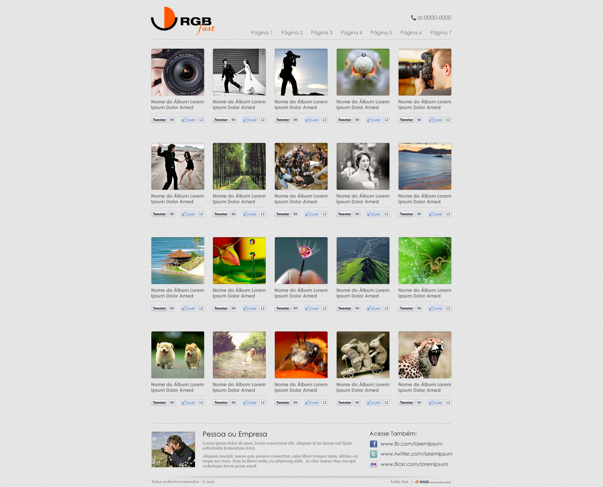

# RGB Comunicação - Teste de Programador:
O teste consiste em reproduzir o layout em anexo, utilizando html + css + Slim Framework.
As informações, com exceção das fotos, devem vir de um banco de dados MySQL / MariaDB, de preferência utilizando o ORM Eloquent para lidar com o banco de dados.
Ignorar os botões de social media abaixo de cada foto.
A estrutura do banco de dados fica a critério do candidato.
O layout deve ser responsivo e sem a utilização de frameworks como bootstrap.
Opcional:
Ao clicar na imagem trazer a mesma em modal com uma descrição vinda do banco de dados.

# Feito:
- [x] Layout responsivo;
- [x] Banco de dados (assets/db)
- [ ] Importação do banco de dados. Alternativa criada:
    * Criação do arquivo data.json com as informações do banco de dados.
    * Upload do conteúdo de data.js para https://api.jsonbin.io/b/621bb87325fb1b26b18985f6.
    * Importação dos dados do arquivo .jason.
        * A intenção foi reproduzir a importação que deveria ser feita do banco de dados original.
        * É uma solução paliativa até conversar com minha equipe na RGB Comunicação e buscar orientação de como resolver o problema de forma definitiva.
        *Todas as funcionalidades exigidas estão presentes.

# Resultado Esperado

    

